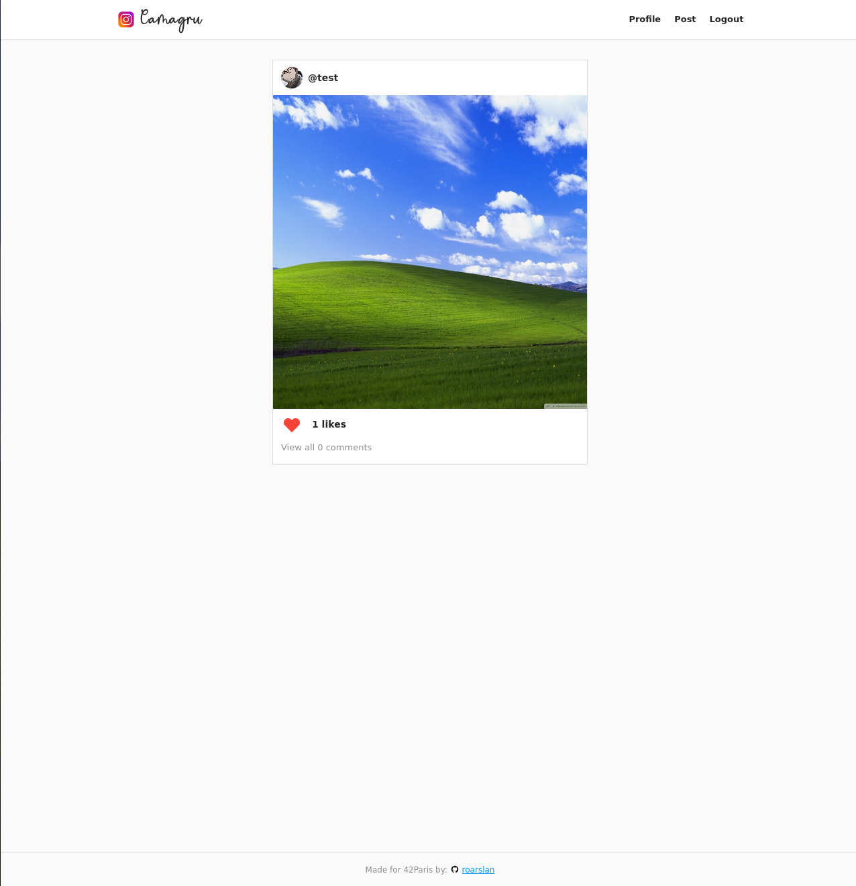
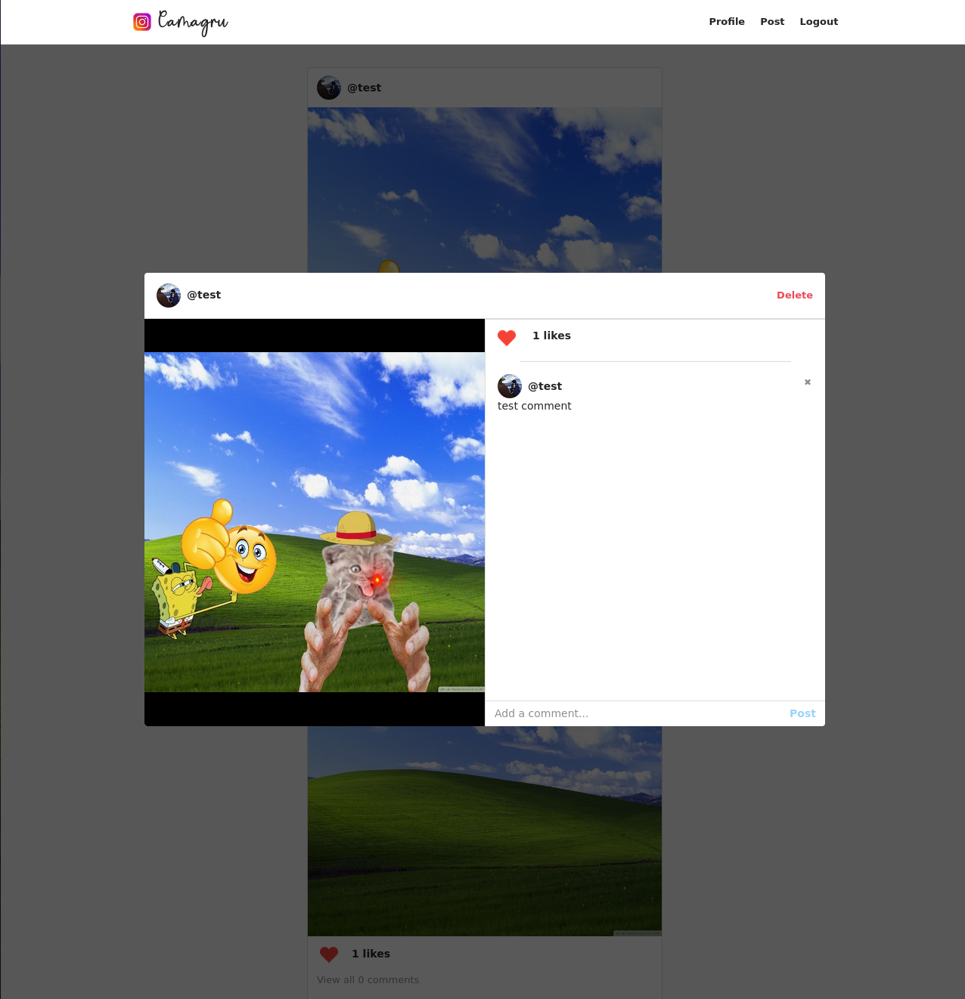
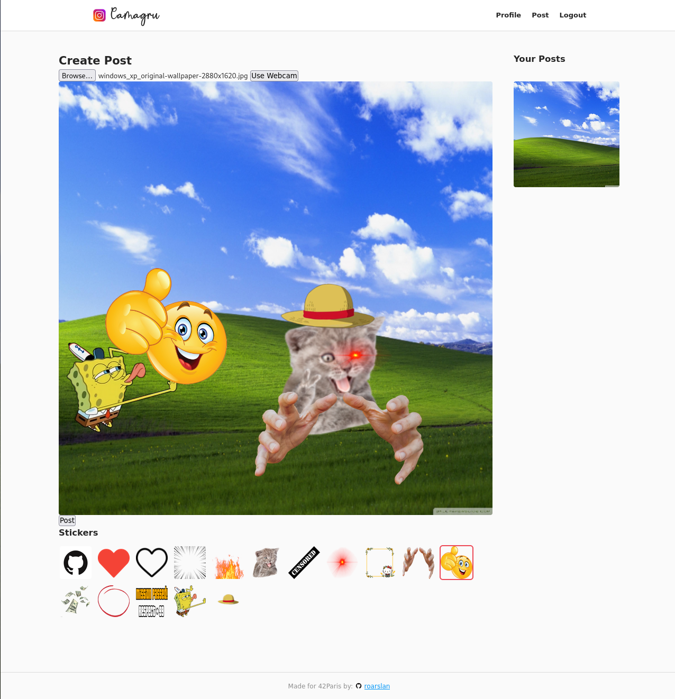
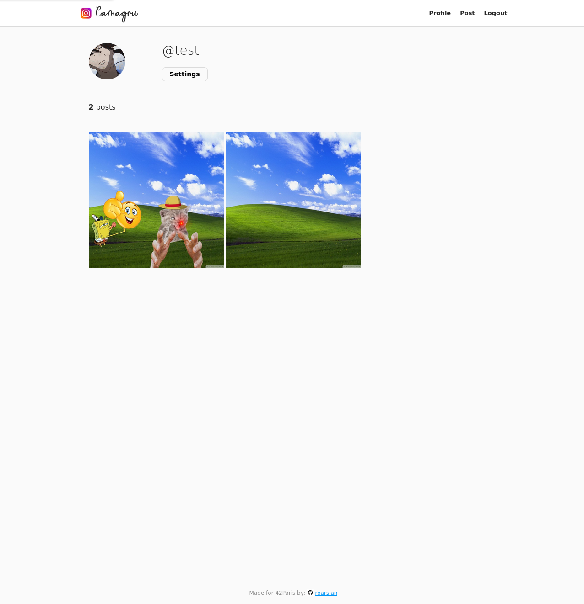
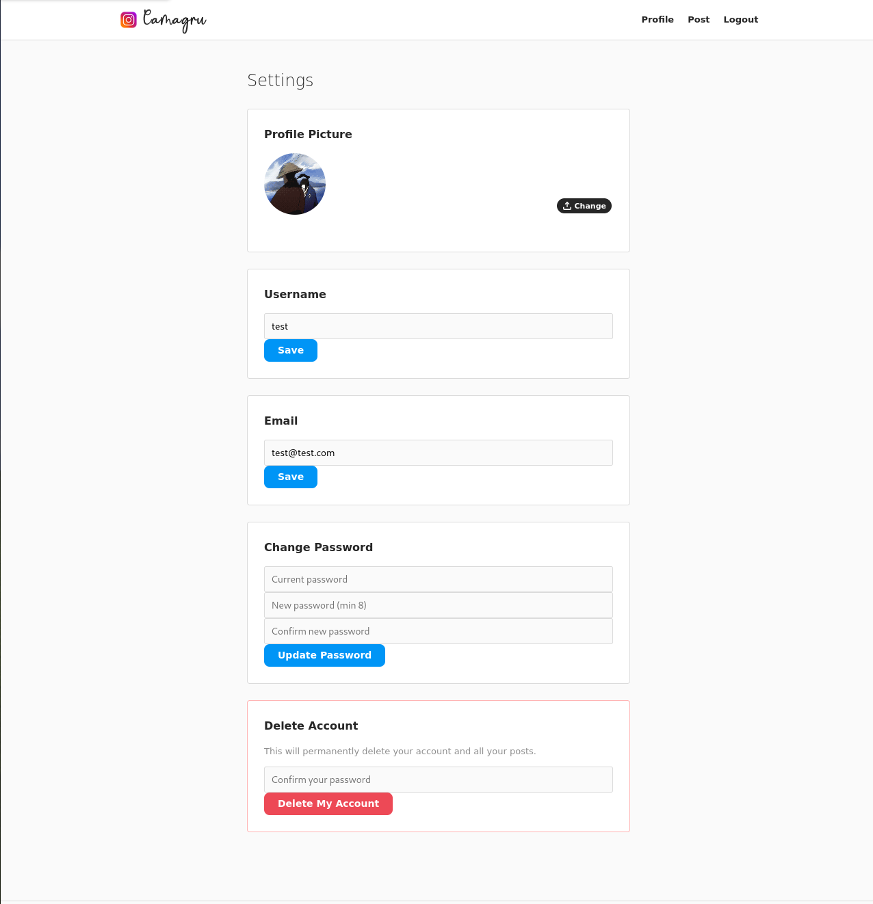

## Camagru
An Instagram-like web application developped with basic PHP, nginx, HTML and CSS

## Usage

1. Create a `.env` file inside the `/src` directory.
2. Make sure you have Docker, Docker Compose, and Make installed.
3. Run:

```bash
make
```

## The website
- The website is accessible on ```localhost:8080```, we can change the port in the docker-compose file.
- The Mailhog service is available on the ```localhost:8025```, it is possible to change the port from the docker-compose file as well.
- We can view the feed while not being logged, but we can't like or comment on the posts

## Features
- User authentication (signup/login/logout)
- Email confirmation via Mailhog
- Create and delete posts
- Like and comment system
- Infinite scroll for feed and profiles
- Profile management (avatar, settings)

## Screenshots
### Feed


### Individual post


### Post creation page


### Profile page


### Settings page


## Tech Stack
- PHP (no framework)
- Nginx
- MySQL
- JavaScript (Vanilla)
- HTML
- CSS
- Docker & Docker Compose
- Mailhog (email testing)

### Author
[Robzzz95](https://github.com/Robzzz95)